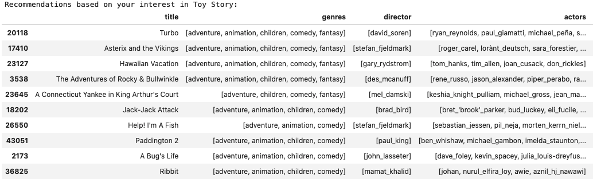
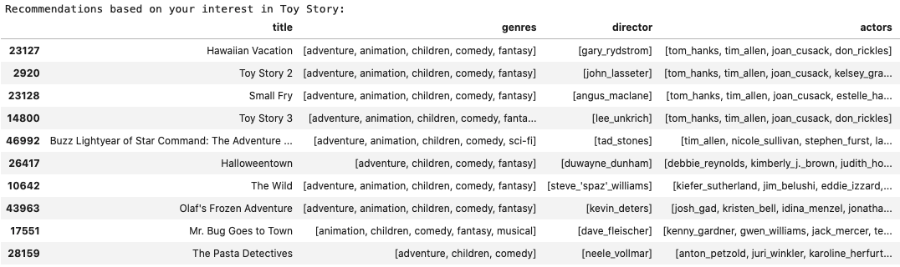
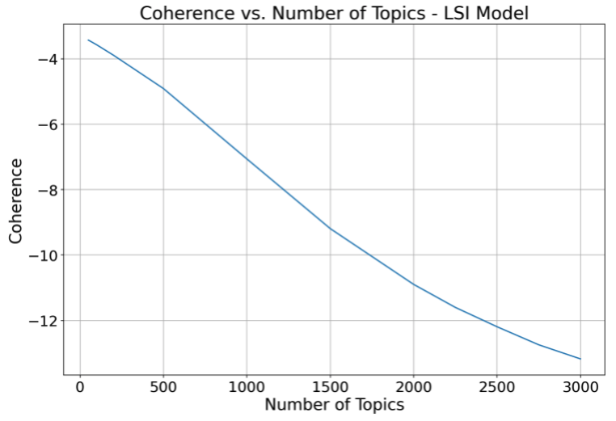

# Minimum Viable Product

### A CONTENT-BASED RECOMMENDER SYSTEM FOR TITLES IN THE TMDB MOVIE DATABASE

The dataset for this project originated on TMDB.org but was downloaded from this source: https://grouplens.org/datasets/movielens/latest/ . It consists of 58,098 movie titles, each with a list of associated genres. Additionally, a companion dataset (downloaded from the same source) contains 10,747,027 user movie ratings (by uniquely-identified user) ranging from 0.0 to 5.0 (with 5.0 being best). The primary project objective is to build a Content-Based Recommender system for new registered users of TMDB.org who do not yet have much (if any) viewing history. This recommender will provide a list of movies most similar to a specified title (presumably, the most recent movie viewed by the new user).

#### Solution Path

For the Content-Based Recommender, similarity is based on consideration of each movie's genre(s), director, four highest-billed actors and text-based plot summary (ranging from 26 to 1000 characeters). This data is tokenized, vectorized and dimension-reduced for each movie, and cosine similarity determines the degree of similarity between each movie in the database and every other (47,723 titles after unusable movies have been eliminated).

#### Work Completed

A Baseline model was built by tokenizing the plot overviews, combining this data with each movie's genre keyword(s), director (full name combined into a single text string), and top-four actors (each combined into a single text string) to form an overall bag of words. This was then converted into a document-term matrix using CountVectorizer and removing stopwords. Dimensionality reduction (using TruncatedPCA) was applied to this matrix, and the results were used to generate a cosine similarity matrix (47,723 x 47,723) between all movies. A function was then written to take a single movie as input and return the N most similar movies based on cosine similarity (with N=10 used thus far).

It was observed that CountVectorizer returned over 150,000 unique columns in the document-term matrix, leading to an extremely low degree of explained variance after application of TruncatedPCA (less than 10%), so the parameters max_df=0.9 and min_df=0.03 were used during tokenization to generate a document-term matrix with only 84 columns. Applying TruncatedPCA to this matrix led to the ability to account for over 70% of explained variance, generating the following (baseline) result when applied to the movie Toy Story (movies are listed in decreasing order of similarity):

As can be seen, these recommendations seem reasonable, but close inspection reveals that each recommendation simply relies on matching the genres and completely ignores the director and actors (which appear so infrequently that they do not even survive the CountVectorizer filtering process after min_df and max_df criteria are applied).

Efforts were made with DBSCAN methods to cluster the actors in such a way as to create an "Actors Group" feature that might behave in much the same way as the broad genre categories. However, even with considerable re-tuning, no practical or meaningful clusters could be found due to massive asymmetry in the cluster sizes (i.e. the vast majority of actors always wound up clustered together and the smaller clusters were randomly over-specific to extremely small actor sub-groups).

Additional modeling efforts involved using TFIDF instead of CountVectorizer and using Rake NLTK or SpaCy keyword extraction on the plot overview text, but all such efforst still generated results which seemed overly reliant on simple genre-matching to the exclusion of director/actors/plot overview.

#### Recent Findings

The most recent work has focused on generating topic models for each movie using the Gensim NLP library. While Gensim's Latent Dirchlet Allocation (LDA), Hierarchical Dirichlet Process (HDP) and Random Projections models did not pan out particularly well, Latetent Semantic Indexing (LSI) models did, generating topics from combinations drawn out of the dataset's bag of words. Much tuning has been performed and efforts made to filter down the number of unique unique tokens to as little as appoximately 16,000. However, these models never performed as well as not filtering and just using all unique tokens generated from the dataset (approximately 177,000 tokens, including bi-grams and tri-grams) . These tokens were used to generate 3000 topics with which to model each movie.  After computing cosine similarities using LSI, the following recommendations were generated for Toy Story:

As can be seen above, LSI topic modeling results in recommendations that apparently try to match not just the genre(s) but also the actors and specifics of the plot summaries (to the extent possible). This explains why many Toy Story-related films figure so prominently in the list above.

The topic coherency plot for this LSI model appears below, showing the justification for using 3000 topics. (Time and hardware considerations make using more than 3000 topics computationally impractical):

#### Plan Forward

Having established an acceptable level of performance for the Content Based Recommendation system, the next step will be to add a Collaborative Recommender component to ultimately create a Hybrid Recommendation system. This will make use of the TMDB user movie ratings data. The collaborative portion of the system will make recommendations for a user who has rated at least some movies by drawing from the highly-rated movies of others who have similarly rated the user under consideration's movies. The hybrid component of the overall system will attempt to find an equitable way to apportion recommendations between purely content-based and purely collaboratively-based (except in the case of users with no rated movies, where recommendations would obviously be purely content-based).

If any additional time remains before the deadline, Word2Vec/Doc2Vec models may also be considered as an alternative to the current Gensim LSI-based content recommender.
